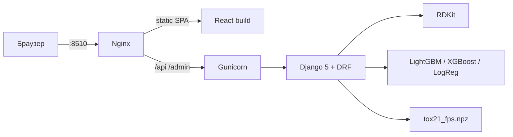

# ToxMol AI

QSAR-сервис по датасету [Tox21](https://moleculenet.org/datasets-1) (MoleculeNet): по SMILES считаются вероятности активности на 12 NR/SR-эндпоинтах, physchem-профиль, ближайшие аналоги в Tox21 и короткие SMARTS-маршруты ретросинтеза.

Не медицинское изделие и не замена in vitro / in vivo. Это воспроизводимый research → API → UI пайплайн для портфолио и внутренних экспериментов.

[](https://www.python.org/)
[](https://www.djangoproject.com/)
[](https://react.dev/)
[](https://www.rdkit.org/)
[](https://docs.docker.com/compose/)

**Демо (Docker):** UI и API на одном порту **8510** — не пересекается с n8n (`5678`), типичным backend (`8000` / `8088`) и соседним фронтом (`3001`).

---

## Что умеет

- Ввод **SMILES** или рисование структуры в **Ketcher** (синхронизация SMILES ↔ molfile)
- Инференс по 12 эндпоинтам Tox21: Nuclear Receptor (NR) и Stress Response (SR)
- Physchem + правила Lipinski / Veber (это не отдельные ADMET-модели)
- Top-N похожих молекул по Tanimoto на Morgan ECFP4
- Rule-based ретросинтез на 1–2 стадии (RDKit reaction SMARTS)
- Django Admin с логом `PredictionJob`

---

## Архитектура

Демо-стек — два контейнера. Снаружи открыт только Nginx.




| Сервис | Образ | Хост-порт | Зачем |
|--------|--------|-----------|--------|
| `web` | `nginx:1.27-alpine` + собранный SPA | **8510** | UI, прокси `/api` и `/admin` |
| `api` | `python:3.10-slim` + RDKit/sklearn/бустинги | не публикуется | инференс, SQLite, WhiteNoise |

В serving-образ **нет** PyTorch, Jupyter, FLAML, CatBoost и ClearML. Lightning-чеки остаётся research-артефактом: если `.pt` нет или torch не установлен, API берёт classical fallback.


```
backend/     Django API (molecules, predictions, similarity, retrosynthesis)
frontend/    React 18 + Vite + Tailwind + Ketcher
src/         research helpers: fingerprints, FLAML, Lightning, ClearML
notebooks/   research.ipynb — EDA и сравнение моделей
data/raw/    tox21.csv.gz (MoleculeNet)
docs/        схемы для README
```

---

## Стек и зачем он здесь

| Слой | Технологии | Роль |
|------|------------|------|
| Frontend | React 18, Vite 5, Tailwind, Framer Motion, Ketcher | ввод структуры, пайплайн-анимация, вкладки результатов |
| Backend | Django 5, DRF, Gunicorn, WhiteNoise, SQLite | REST, админка, статика admin без отдельного volume |
| Химия | RDKit | парсинг SMILES, SVG, Morgan FP, SMARTS-реакции, Lipinski/Veber |
| ML (research) | FLAML, LightGBM, XGBoost, PyTorch Lightning, ClearML | подбор моделей по 12 эндпоинтам |
| ML (demo) | joblib + LightGBM / XGBoost / LogisticRegression | узкий образ, CPU-only |
| Infra | Docker Compose, Nginx Alpine | Cloud.ru / локальное демо на порту 8510 |

---

## Модели инференса

Победители по `test_roc_auc` из research. Если Lightning-веса отсутствуют, API обучает/подхватывает classical fallback при первом `prepare_models`.

| Target | Предпочтительно | Fallback |
|--------|-----------------|----------|
| NR-AhR | FLAML LightGBM | — |
| NR-Aromatase | FLAML LightGBM | — |
| NR-ER | FLAML LightGBM | — |
| NR-PPAR-gamma | FLAML LogReg L1 | — |
| NR-AR | FLAML XGBoost | — |
| SR-ARE, SR-HSE, SR-p53 | FLAML LightGBM | — |
| NR-AR-LBD, NR-ER-LBD, SR-MMP | Lightning GNN | XGBoost / LightGBM |
| SR-ATAD5 | Lightning ResNet | LogReg L1 |

**ADMET в UI** — дескрипторы RDKit и правила Lipinski/Veber плюс сводка Tox21. Отдельных PK-моделей в репозитории нет.

---

## Быстрый старт (демо)

Нужны Docker Engine и Compose v2. Первый запуск API строит индекс фингерпринтов и, если нет `.joblib`, обучает 12 лёгких classical-моделей (примерно 5–15 минут, CPU).

```bash
cp .env.example .env
docker compose up --build
```

- UI: http://127.0.0.1:8510
- API health: http://127.0.0.1:8510/api/health/
- Admin: http://127.0.0.1:8510/admin/

```bash
docker compose exec api python manage.py createsuperuser
```

Остановка: `docker compose down`. Модели и SQLite лежат в named volumes (`toxmol_models`, `toxmol_var`) — повторный `up` без переобучения.

---

## Cloud.ru

Порт **8510/tcp** в security group. Не занимать 5678, 8000, 8088, 3001.

1. VM Ubuntu 22.04, Docker + Compose plugin.
2. `git clone` репозитория, `cp .env.example .env`.
3. Задать `DJANGO_SECRET_KEY` и origin ВМ:

```bash
python3 -c "import secrets; print(secrets.token_urlsafe(48))"
```

```env
DJANGO_DEBUG=0
DJANGO_SECRET_KEY=<сгенерированный ключ>
DJANGO_ALLOWED_HOSTS=<публичный-ip>,localhost
CORS_ALLOWED_ORIGINS=http://<публичный-ip>:8510
CSRF_TRUSTED_ORIGINS=http://<публичный-ip>:8510
```

4. `docker compose up -d --build`
5. Открыть `http://<публичный-ip>:8510`

Если перед инстансом HTTPS-балансировщик — пропишите `https://...` в `CORS_*` / `CSRF_*`. API уже читает `X-Forwarded-Proto`.

Оценка размера: serving-образы без CUDA и Jupyter; фронт — multi-stage (Node → Nginx Alpine).

---

## Локальная разработка

API на **8511**, Vite на **5173** (прокси `/api` → 8511).

```powershell
pip install -r backend/requirements.txt
cd backend
$env:PYTHONPATH = ".."
python manage.py migrate
python manage.py prepare_models
python manage.py runserver 0.0.0.0:8511
```

```powershell
cd frontend
npm install
npm run dev
```

Research-ноутбук (не нужен для демо):

```bash
docker compose -f docker-compose.research.yml --profile cpu up --build
```

Jupyter: http://127.0.0.1:8889 (хост-порт 8889, чтобы не спорить с чужим 8888). GPU-профиль: `--profile gpu` и корневой `Dockerfile` (CUDA 11.8).

---

## API

Все пути с хоста демо идут через Nginx `:8510`.

| Method | Path | Назначение |
|--------|------|------------|
| GET | `/api/health/` | liveness + статус артефактов |
| POST | `/api/molecule/parse/` | SMILES → SVG, physchem, molblock |
| POST | `/api/molecule/from-molfile/` | molfile → SMILES + SVG |
| POST | `/api/predict/` | QSAR / NR / SR / Lipinski |
| POST | `/api/similar/` | top-N Tanimoto по Tox21 |
| POST | `/api/retrosynthesis/` | SMARTS-маршруты, `max_depth` 1–2 |

```bash
curl -X POST http://127.0.0.1:8510/api/molecule/parse/ \
  -H "Content-Type: application/json" \
  -d "{\"smiles\": \"CCO\"}"
```

Переменные — в `.env.example`.

---

## Данные

`data/raw/tox21.csv.gz` лежит в репозитории (~123 КБ). При отсутствии файл качается с MoleculeNet S3. Индекс `data/processed/tox21_fps.npz` строится командой `prepare_models` и в git не хранится.
